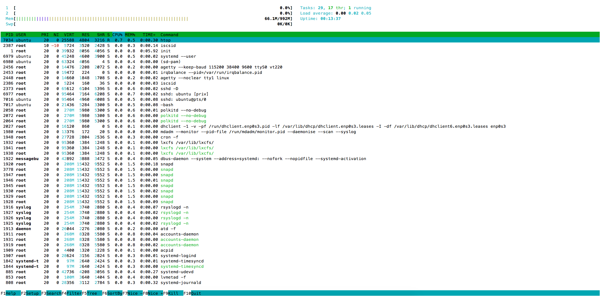
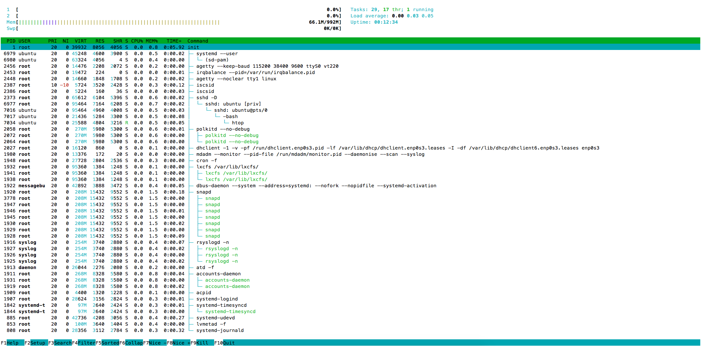
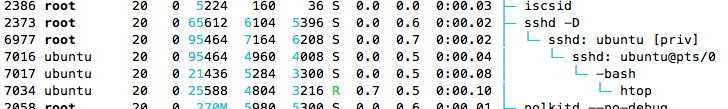

# Top Down Guide To Linux

A top down guide to how linux works using an Ubuntu VM, htop, osquery and python.
Everyone at some point takes an Operating Systems course, however it can be difficult to relate,
abstract concepts as you learn with system. This guide tries to provide an interactive journey through
a linux operating system.

### exploring processes using HTOP

Htop is a superior version of built in top. It offers a more intuitive and colourful UI. 

##### htop processes sorted

##### htop processes sorted

##### htop in htop

### Facebook osquery
The osquery tool by Facebook provides all Operating System information including the state in a 
consisted relational database format. 

* List of tables: [https://osquery.io/docs/tables/](https://osquery.io/docs/tables/)
* Query packs: [https://osquery.io/docs/packs/](https://osquery.io/docs/packs/)

### Simple python experiments
 
 1. experiment_1.py
 

